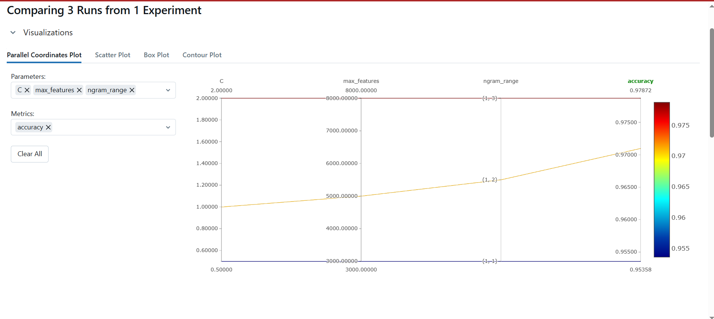

#  SMS Spam Sınıflandırma - MLflow Deney Notları

Bu çalışma, SMS spam tespiti için Logistic Regression + TF-IDF modeliyle yapılmıştır.  
Denemeler MLflow üzerinden izlenmiş ve parametre-tabanlı koşular kaydedilmiştir.

---

## 🔧 Deneme Parametreleri

| Run # | ngram_range | max_features | C    | Accuracy |
|-------|-------------|--------------|------|----------|
| 1     | (1, 1)      | 3000         | 0.5  | 0.9700   |
| 2     | (1, 2)      | 5000         | 1.0  | 0.9497   |
| 3     | (1, 3)      | 8000         | 2.0  | 0.9787 ✅ (en iyi)

---

##En İyi Koşu

- **Run ID:**  

---

##  MLflow UI

- **Ekran Görüntüsü:**  

- **Artefact Linki:**  
(Yalnızca lokal ortamda geçerli)  
[http://127.0.0.1:5000/#/experiments](http://127.0.0.1:5000/#/experiments)

---

##  Kayıtlı Dosyalar

- `spam_mlflow_runner.py` – Tüm koşu scripti  
- `best_run.txt` – En iyi koşunun run_id’si  
- `mlflow_screen.png` – UI ekran görüntüsü  
- `exp_notes.md` – Bu açıklama dosyası

